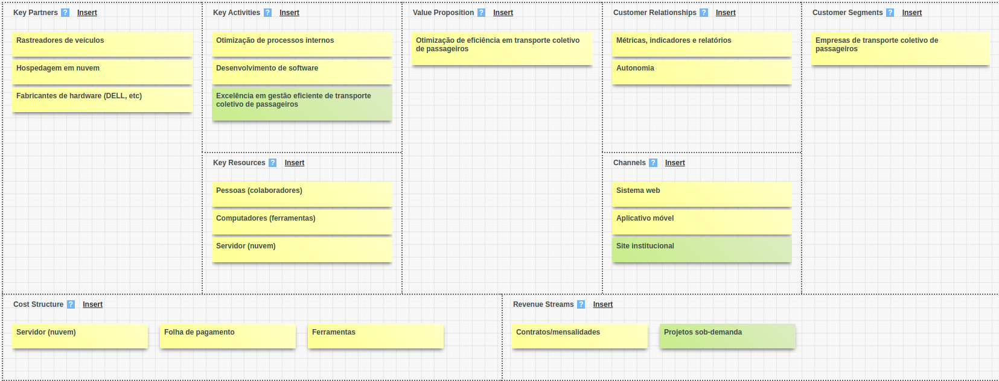
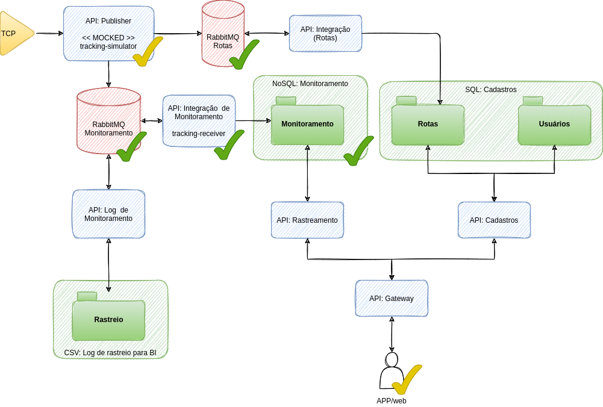

# Tracking Vehicles Application

Study project for tracking vehicles using microsservices, Typescript, Node.js, React, TDD, DDD, MongoDB, Postgres, TypeORM, Mongoose and RabbitMQ (amqplib).

## Requirements

- Node 14.7.0+: [https://nodejs.org/en/download/](https://nodejs.org/en/download/)
- Yarn LTS: [https://classic.yarnpkg.com/en/docs/install/](https://classic.yarnpkg.com/en/docs/install/)
- Docker Desktop: [https://www.docker.com/products/docker-desktop](https://www.docker.com/products/docker-desktop)

## Environment setup

### Installing RabbitMQ and MongoDB

- Create a new RabbitMQ container
    - `docker run -d --hostname local-rabbitmq --name local-rabbitmq -p 8080:15672 -p 5672:5672 -p 25676:25676 rabbitmq:3-management`
    - [!] If it was succesfully created, you can access it at http://localhost:15672/
    - See more at https://hub.docker.com/_/rabbitmq

- Create our database folder: `sudo mkdir -p /opt/digicounter/database`
- Create a new MongoDB container
    - `docker run -d --hostname local-mongodb --name local-mongodb -p 27017:27017 -e MONGO_INITDB_ROOT_USERNAME=mongoadmin -e MONGO_INITDB_ROOT_PASSWORD=mongoadmin -v /opt/digicounter/database/mongodb:/data/db mongo:latest`
    - See more at https://hub.docker.com/_/mongo
- Create a new MongoDB Admin Panel container
    - `docker run -d --network host --hostname local-mongodb-panel --name local-mongodb-panel -e ME_CONFIG_MONGODB_SERVER=localhost -e ME_CONFIG_MONGODB_ADMINUSERNAME=mongoadmin -e ME_CONFIG_MONGODB_ADMINPASSWORD=mongoadmin mongo-express:latest`
    - [!] If it was succesfully created, you can access it at http://localhost:8081/
    - See more at https://hub.docker.com/_/mongo-express

### Running the app

- Use tracking-simulator for simulating vehicle gps tracking data (using rabbitmq queues)
    - `yarn run track-vehicle`
- Use tracking-receiver for receipting vehicles gps tracking data and persisting it in our MongoDB
    - `yarn start`

## Business Canvas

## Project architecture

