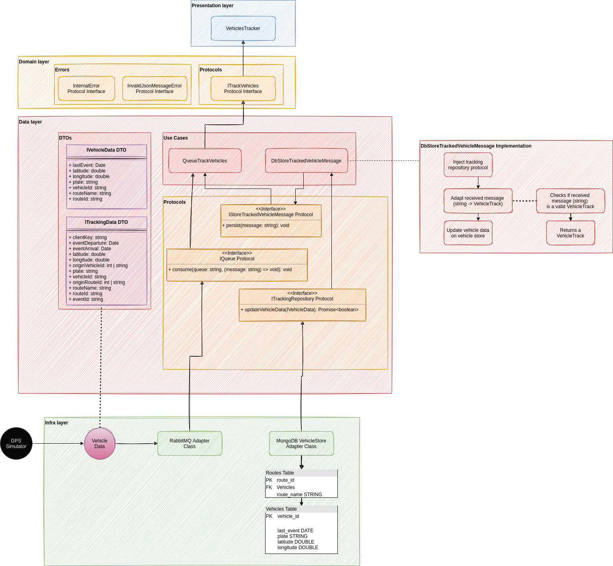

# Tracking data receiver

Responsible for receiving all vehicles tracked data and persist it into our monitoring NoSQL database.
Developed using DDD and TDD, Node.js (with Typescript), Docker containers, RabbitMQ (amqplib) and MongoBD (Mongoose).

- To run our tests coverage: `yarn test:ci`
- To start listening to tracked vehicles message: `yarn dev`
  - Please, read our root README for more informations

## Architecture

